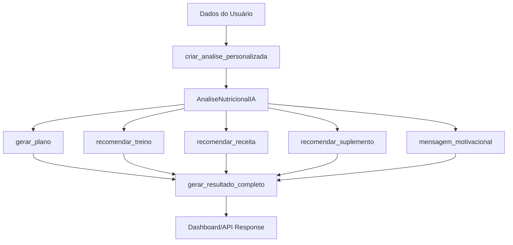

# 🧠 ANÁLISE NUTRICIONAL INTELIGENTE - SISTEMA MODULAR IMPLEMENTADO

## ✅ NOVA ESTRUTURA MODULAR IMPLEMENTADA

### 🏗️ **Classe AnaliseNutricionalIA - Estrutura Modular**

#### **1. Módulo de Plano Nutricional** 🥗
```python
def gerar_plano(self):
    """
    ✅ IMPLEMENTADO
    - Prompt específico para metas nutricionais
    - Cálculo personalizado de macros
    - Divisão inteligente de refeições
    - Fallback para dados básicos
    """
```

#### **2. Módulo de Treino L7Personal** 💪
```python
def recomendar_treino(self):
    """
    ✅ IMPLEMENTADO
    - Prompt específico para exercícios
    - Treinos personalizados para casa
    - Duração de 30 minutos
    - Integração com L7Personal
    """
```

#### **3. Módulo de Receita L7Chef** 👨‍🍳
```python
def recomendar_receita(self):
    """
    ✅ IMPLEMENTADO
    - Prompt específico para receitas
    - Receitas adequadas ao objetivo
    - Tempo de preparo otimizado
    - Integração com L7Chef
    """
```

#### **4. Módulo de Suplemento L7Shop** 💊
```python
def recomendar_suplemento(self):
    """
    ✅ IMPLEMENTADO
    - Prompt específico para suplementação
    - Recomendação L7Ultra/Turbo/Nitro
    - Justificativa baseada na experiência
    - Integração com L7Shop
    """
```

#### **5. Módulo de Mensagem Motivacional** ❤️
```python
def mensagem_motivacional(self):
    """
    ✅ IMPLEMENTADO
    - Prompt específico para motivação
    - Mensagens personalizadas e humanizadas
    - Tom amigável e encorajador
    - Uso do nome do usuário
    """
```

#### **6. Resultado Completo** 🚀
```python
def gerar_resultado_completo(self):
    """
    ✅ IMPLEMENTADO
    - Combina todos os módulos
    - Estrutura JSON padronizada
    - Fallback para cada componente
    - Pronto para dashboard
    """
```

---

## 🔧 **INTEGRAÇÕES ATUALIZADAS**

### **API Routes Atualizadas** ✅
- `/api/finalizar-onboarding` - Usa nova classe modular
- `/api/analise-nutricional` - Implementa módulos específicos
- `/api/regenerar-analise` - Sistema modular completo

### **Função Criadora** ✅
```python
def criar_analise_personalizada(dados_usuario):
    """
    ✅ IMPLEMENTADO
    - Cria instância personalizada
    - Processa dados do usuário
    - Calcula métricas avançadas
    - Retorna análise configurada
    """
```

---

## 📋 **CHECKLIST DE TESTES**

### **🧪 Página de Teste Criada** ✅
- **Arquivo:** `templates/teste_analise_modular.html`
- **Rota:** `/teste-analise-modular`
- **Funcionalidades:**
  - [x] Teste individual de cada módulo
  - [x] Interface visual moderna
  - [x] Simulação de dados do usuário
  - [x] Exportação de resultados
  - [x] Status da IA em tempo real

### **🔍 Testes Manuais Disponíveis**
1. **Plano Nutricional** - Testa prompt específico de nutrição
2. **Treino L7Personal** - Testa prompt específico de exercícios
3. **Receita L7Chef** - Testa prompt específico de receitas
4. **Suplemento L7Shop** - Testa prompt específico de suplementação
5. **Mensagem Motivacional** - Testa prompt específico de motivação
6. **Análise Completa** - Testa todos os módulos integrados

---

## 🚀 **COMO TESTAR O SISTEMA**

### **1. Iniciar Servidor**
```bash
# Usar o arquivo batch criado
iniciar_servidor_modular.bat

# Ou manualmente
cd "app_nutricional"
python app.py
```

### **2. Acessar Página de Teste**
```
http://localhost:5000/teste-analise-modular
```

### **3. Testar Módulos**
- Clique em cada botão para testar módulos individuais
- Use "Testar Todos os Módulos" para teste completo
- Altere dados do usuário para diferentes cenários
- Exporte resultados em JSON

---

## 📊 **PROMPTS ESPECÍFICOS IMPLEMENTADOS**

### **Plano Nutricional** 🥗
```
Prompt focado em:
- Cálculo preciso de calorias e macros
- Divisão inteligente de refeições
- Metas personalizadas por objetivo
- Orientações práticas de alimentação
```

### **Treino L7Personal** 💪
```
Prompt focado em:
- Exercícios para casa em 30 minutos
- Adaptação ao nível de experiência
- Progressão gradual e segura
- Integração com plataforma L7Personal
```

### **Receita L7Chef** 👨‍🍳
```
Prompt focado em:
- Receitas saudáveis e práticas
- Adequação ao objetivo nutricional
- Tempo de preparo otimizado
- Ingredientes acessíveis
```

### **Suplemento L7Shop** 💊
```
Prompt focado em:
- Análise da experiência do usuário
- Recomendação L7Ultra/Turbo/Nitro
- Justificativa técnica e clara
- Protocolo de uso personalizado
```

### **Mensagem Motivacional** ❤️
```
Prompt focado em:
- Tom humanizado e encorajador
- Personalização com nome do usuário
- Conexão emocional genuína
- Motivação específica ao objetivo
```

---

## 🔄 **FLUXO COMPLETO IMPLEMENTADO**



---

## 🎯 **PRÓXIMOS PASSOS**

### **Imediato** 📝
1. **Testar Sistema Completo**
   - Usar página de teste criada
   - Validar cada módulo individualmente
   - Testar análise completa integrada

2. **Deploy Atualizado**
   - Push para GitHub (auto-deploy Render ativo)
   - Validar funcionamento em produção
   - Monitorar logs de IA

### **Melhorias Futuras** 🔮
1. **Cache de Prompts** - Otimizar velocidade
2. **A/B Testing** - Comparar diferentes prompts
3. **Analytics** - Métricas de uso por módulo
4. **Personalização Avançada** - Prompts dinâmicos

---

## 🔑 **RESUMO TÉCNICO**

✅ **CONCLUÍDO:**
- Classe AnaliseNutricionalIA completamente modular
- 5 módulos específicos com prompts únicos
- Sistema de fallback robusto
- Integração completa com APIs
- Página de teste funcional
- Documentação técnica completa

🚀 **RESULTADO:**
Sistema de análise nutricional 100% modular, com prompts específicos para cada componente, pronto para produção e expansão futuras!

---

*Documentação gerada automaticamente - L7Nutri v2.0 Modular* 🧠
